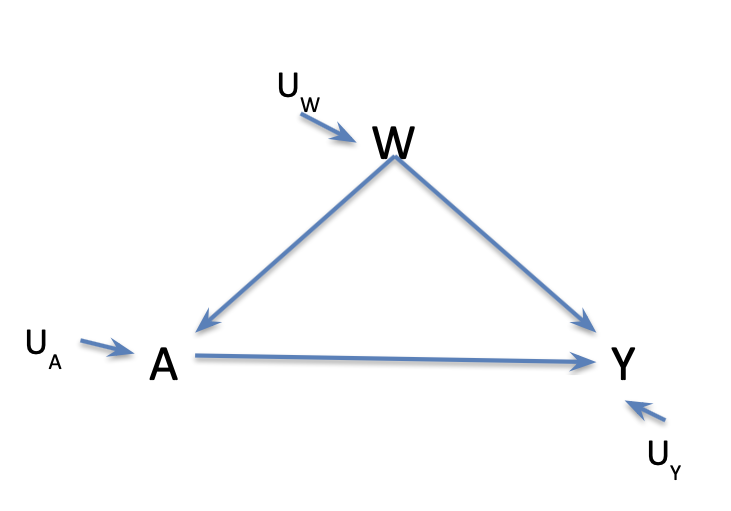

--- 
title: "Causal Learning Handbook"
site: bookdown::bookdown_site
documentclass: book
bibliography: [book.bib, packages.bib]
url: https://amertens.github.io/causal-learning-handbook/
# cover-image: path to the social sharing image like images/cover.jpg
description: |
    Causal learnin handbook, including interactive targeted learning workshop materials and linkouts to annotated bibliographies and more advanced examples.
github-repo: https://github.com/amertens/causal-learning-handbook
---


Welcome!  

This site introduces the **Causal Roadmap**, **Targeted Maximum Likelihood Estimation (TMLE)**, and **Super Learner** for modern causal inference in epidemiology, with an emphasis on pharmacoepidemiology and clinical trial analysis.


```{r include=FALSE}
# automatically create a bib database for R packages
knitr::write_bib(c(
  .packages(), 'bookdown', 'knitr', 'rmarkdown', 'tidyverse', 'here'
), 'packages.bib')
```

```{r, eval=F, include=F}

#to create the book
library(bookdown)
library(rsconnect)
 


#render locally
bookdown::render_book("index.Rmd")

 
#https://amertens.github.io/causal-learning-handbook/


```


<!--chapter:end:index.Rmd-->


# Tutorial on Targeted Learning and the Causal Roadmap


```{r setup, include=FALSE}
knitr::opts_chunk$set(echo = TRUE)
```

## Introduction

This tutorial provides a gentle introduction to the Causal Roadmap and its applications in pharmaco-epidemiologic research. It is designed for a broad audience, including learners from both academia and industry. We systematically walk through each step of the Causal Roadmap—from explicitly formulating a research question, to translating it into a formal causal estimand, to identifying and estimating that estimand from observed data, and finally to drawing valid inferences and interpreting results. Each step is illustrated using a working example from a pharmaco-epidemiology setting, accompanied by interactive, built-in code to facilitate hands-on learning. The structure and content of this tutorial follow, in an analytical way, the Introduction to Causal Inference and the causal Roadmap course (htp://www.ucbbiostat.com/) Petersen and Balzer. 

## Why venture down a new path?

Adopting the Causal Roadmap in our approach to research in causal inference enables us to clearly state a scientific question and select an analtyic approach that matches the question being asked while ensuring systematic assessment of our ability/feasibility  to answer this question from the data we observe (identifiability). Head to head analysis method comparison lets us select the best approach. 

We will now formally introduce the Causal Roadmap but before let us go over some notation!

## Notation
* ***A***: Exposure/Treatement
  * The term treatment is often used in causal inference even with exposures that are not medical treatments. We shall use A=1 for exposed (treated) and A=0 for unexposed (untreated)
* ***Y***: outcome 
* ***W***: set of measured confounding variables
* ***U***: set of unmeasured factors
* $\mathbb{E}[Y|A=a]$: expected outcome Y among those who experience exposure A=a in our population. This is a descriptive measure
* $\mathbb{E}[Y_{a}]$: expected counterfactual outcome $Y_a$ when all experience exposure A=a in our population. This is a causal quantity. Generally $\mathbb{E}[Y|A=a]$ does not equal to $\mathbb{E}[Y_{a}]$ and this is the fundamental problem of causal inference
* $\mathbb{E}[Y|A=a,W=w]$: expected outcome Y among those who expereince exposure A=a and have covariates W=w,  in our population. For example this can be the mean outcome among exposed men. These conditional expectations are often estimated using multivariable regression models.
* $\mathbb{E}[\mathbb{E}[Y|A=a,W=w]]$:expected outcome Y among those who experience exposure A=a and have covariates W=w,averaged across covariate strata in the population. This is a marginal expectation.

## Motivation
* Suppose we are interested in the impact of Drug A vs Drug B on risk of cardiovascular disease among postmenopausal women with osteoporosis. 
* Our usual approach would be to collect data on the intervention, outcome (cardiovascular disease ) and some covariates. Since the outcome is binary, we would use a logistic regression to estimate the conditional odds ratio by exponentiating the regression coefficient on the intervention (treatment).
* The problem with is approach is that it allows the tool i.e. logistic regression to define the question we answer rather than starting with the question and picking amongst tools that allow us to answer the question.
* To address this problem, we introduce the Causal Roadmap!

 
## The Causal Roadmap

The Causal Roadmap is a framework that provides a systematic process to move from a research question to estimation and interpretation which guides investigators on how to design and analyse their studies a priori. This framework has the following steps;

+ Stating the research question and hypothetical experiment
+ Defining the causal model and parameter of interest
+  Linking the causal model to the observed data and defining the statistical model
+  Assessing identifiability: linking the causal effect to a parameter estimable from the observed data
+  Selecting and applying the estimator
+ Deriving an estimate of the sampling distribution (statistical uncertainty)
+ Making inference (interpreting findings)

We shall now delve into each of these steps in details!

## Step 0: State the question
* This is the very first step of the roadmap. A helpful way to be clear about the scientific question is to  explicitly state the experiment that would unambiguously yield estimates of the causal effect of interest. 
* For example: What is the effect of a certain medication  on the incidence of cardiovascular disease  among postmenopausal women who initiated Drug A vs Drug B in the United States?
* We can consider a hypothetical experiment where we ask what would be the the difference in CVD incidence if patients received the intervention drug A vs if all patients received the control drug B (or standard of care).
* To sharply frame our research question, we want to be more specific about;
  * The target population (What age group? where?)
  * The exposure (What dosage? Frequency?)
  * The outcome (over what timeframe?)
  * Ways to change the exposure and their plausibility
* Other interesting hypothetical experiments could include:
  * What would be the difference in CVD incidence if patients were initiated on drug A once they reached a certain risk threshold vs if all patients are initiated on Drug A regardless of their risk profile? 
  * What would be the difference in CVD incidence if an additional 10% of patients received the intervention compared to if the intervention uptake remained as observed? 
  
* We note that there is massive flexibility in how we can define our desired hypothetical experiments. 
 
### Target Trial Emulation

The hypothetical experiment defined in Step 0 can be viewed as a target trial.

Observational studies aim to emulate this trial by aligning eligibility criteria, treatment assignment, follow-up, outcome definitions, and estimands.

The Causal Roadmap provides the formal structure for conducting such emulations transparently.

 
 
## Step 1: Define the causal model 
* Causal modeling formalizes our knowledge however limited. We are able to explore which variables affect each other, examine the role of unmeasured factors and the functional form of the relationships between variables. 
* In this tutorial, we shall focus on structural causal models and corresponding causal graphs (Pearl 2000). However, we do note that their are many other causal frameworks. 
* The figure 1 below corresponds to a simple  causal graph with corresponding structural casual model as follows;
  *  $W= f_w(U_w)$
  * $A= f_A(W,U_A)$
  * $Y = f_Y(W,A,U_Y)$
* We make no assumptions on the background factors $(U_w,U_A,U_Y)$ or on the functional forms of functions $(f_w,f_A,f_Y)$

```{r include-image, echo=FALSE, out.width="70%", fig.align="center"}
knitr::include_graphics("cm1.png")
```

* If you believed no unmeasured confounding, a possible causal model and graph (figure 2) would be;
   *  $W= f_w(U_w)$
  * $A= f_A(W,U_A)$
  * $Y = f_Y(W,A,U_Y)$
* Here we assume that the background factors are all independent but still make no assumption on the functional forms of $(f_w,f_A,f_Y)$
* However, it is important to note that wishing for something does not make it true. 

```{r echo=FALSE, out.width="70%", fig.align="center"}

```

## Step 2: Define the causal parameter of interest
* We now define counterfactuals by intervening on the causal model.  We can do this by setting the exposure to a specific level e.g A=1 for all units.
  *  $W= f_w(U_w)$
  * $A= 1$
  * $Y_1 = f_Y(W,1,U_Y)$ where $Y_1$ is the outcome if possibly-contrary to fact, the unit was exposed (A=1)
  
```{r echo=FALSE, out.width="70%", fig.align="center"}
knitr::include_graphics("cm3.png")
```
  
* Analogously, we can intervene on the causal model by setting A=0
  *  $W= f_w(U_w)$
  * $A= 0$
  * $Y_0 = f_Y(W,0,U_Y)$ where $Y_0$ is the outcome if possibly-contrary to fact, the unit was exposed (A=0)
  
```{r echo=FALSE, out.width="70%", fig.align="center"}
knitr::include_graphics("cm5.png")
```  
  
* We use counterfactuals to define the causal parameter;
  * For example, the difference between the expected counterfactual outcomes under these two interventions i.e $\mathbb{E}[Y_1]-\mathbb{E}[Y_0]$ which is known as the average treatment effect(ATE)
  * For a binary outcome, we define the causal risk difference (CRD) as $\mathbb{P}(Y_1=1)-\mathbb{P}(Y_0=1)$.
* Many other causal parameters are possible!!
  
### Estimand Specification (ICH E9[R1] Framework)

An estimand precisely defines the treatment effect of interest by specifying all attributes of the causal question.

| Attribute | Specification |
|----------|---------------|
| Population | Eligible individuals meeting study inclusion criteria |
| Treatment Strategies | Intervention A versus comparator B |
| Endpoint | Binary or time-to-event outcome within a fixed horizon |
| Intercurrent Events | Addressed via treatment-policy or hypothetical strategy |
| Summary Measure | Risk difference, risk ratio, or mean difference |

Explicit estimand specification ensures alignment between the scientific question, identification assumptions, and estimation strategy.

### Treatment-Policy versus Hypothetical Estimands

A treatment-policy estimand contrasts outcomes under initial treatment assignment regardless of subsequent treatment changes (i.e., intention-to-treat estimates as presented in this workshop).

A hypothetical estimand contrasts outcomes under a counterfactual world in which intercurrent events (e.g., switching or discontinuation) do not occur.

The choice between these estimands reflects different scientific questions and determines how intercurrent events are handled during analysis.

### Intercurrent Events

Intercurrent events are post-treatment events that affect the interpretation or existence of the outcome, such as treatment switching, discontinuation, or death.

Handling of intercurrent events must be specified at the estimand stage, not deferred to estimation. Common strategies include:

- Treatment-policy: ignore the intercurrent event
- Hypothetical: censor or reweight to eliminate its occurrence
- Composite: redefine the outcome to include the event

This choice determines the causal question being answered.

### Time-to-Event Outcomes and Risk-Based Estimands

In many applications, outcomes occur over time and are subject to censoring.

Rather than targeting hazard ratios, the Causal Roadmap naturally accommodates risk-based estimands, such as cumulative incidence at a fixed time horizon.

For example, the causal risk difference at 90 days compares the probability of experiencing the event by day 90 under each treatment strategy.


## Step 3: Link to observed data

* Observed data are denoted O=(W,A,Y) where W reprensents measured covariates, A is the exposure and Y is the outcome. 
* We assume that the causal model provides a description of our study under existing conditions(i.e. the real world) and under interventions (i.e.the counterfactual world)
* This provides a link between the causal world and the real (observed) world and therefore our causal model implies our statistical model which is the set of possible distributions of observed data.
* The causal model may but often does not place any restrictions on the statistical model in which case the statistical model is ***non parametric***.
 * For example our model says that A is a function of W and $U_A$ but does not specify the form of that function: A= $f_A(W,U_A)$. However, if we know the form, that should be specified in the causal model. 

### Observed-Data Censoring Rules

The observed data structure must specify which events terminate follow-up and how they relate to the estimand.

Censoring may occur due to administrative end of follow-up, loss to follow-up, or treatment switching.

Whether censoring is causal or administrative depends on the estimand and must be addressed through design or analysis.


## Step 4: Assess Identifiablity
* This process involves linking the causal effect to the parameter estimable from observed data. This requires some assumptions as follows:
  * Temporality: exposure precedes the outcome. This is indicated by an arrow on the causal graph from A to Y
  * Consistency: $Y_a$=Y where A=a. If an individual received treatment A=a, then their observed outcome Y is equal to their potential outcome under that treatment $Y_a$.
  * Stability: We require no interference between units. This is indicated by the fact that the outcomes Y are only a function of each unit's exposure A in the causal model and graph.
  * Randomization:No unmeasured confounding such that $Y_a \perp A \mid W$ 
  * Positivity: We require sufficient variability in exposure within confounder values i.e. $0 < \mathbb{P}(A=1|W)<1$. 
* With these assumptions, we can express our causal target parameter which is a function of counterfactuals in terms of our observed data i.e
$$
\begin{aligned}
\mathbb{E}(Y_a)
    &= \mathbb{E}\big[ \mathbb{E}(Y_a \mid W) \big] \\
    &= \mathbb{E}\big[ \mathbb{E}(Y_a \mid A=a, W) \big]  under \ randomization\\ 
    &= \mathbb{E}\big[ \mathbb{E}(Y \mid A=a, W) \big] under \ consistency
\end{aligned}
$$

* Again wishing for something does not make it true.
* Under the above assumptions we can have the G-computation identifiability result (Robins 1986) as
  * $\mathbb{E}[Y_1-Y_0] = \mathbb{E}\big[\mathbb{E}(Y\mid A=1,W)-\mathbb{E}(Y\mid A=0,W)]$ where the right handside is our parameter of interest a.k.a our statistical estimand. **Connection to estimation:** The g-computation (simple substitution) estimator in Step 5 directly implements this identified functional by estimating \(E[Y \mid A, W]\), predicting under \(A=1\) and \(A=0\), and averaging over \(W\). In other words, Step 5 begins by turning the Step 4 identification formula into an explicit computational procedure.
  * For a binary outcome, we have the marginal risk difference as \mathbb{E}\big[\mathbb{P}(Y=1\mid A=1,W)-\mathbb{P}(Y=1\mid A=0,W)]$. This is marginal because the outer expectation averages over the confounder distribution. 

* What if the assumptions are not all met? For example one might be worried about unmeasured confounders or that the data structure does not assure temporality.Possible options include;
  * Giving up!!
  * Changing the research question, the exposure, the outcome or the target population
  * Proceeding to do the best job possible estimating the target parameter provided the question is still well-defined and interpretable and that we  can still get as close as possible to the wished for causal parameter given the limitations in the data. 
  
  
*Assessing Assumptions in Real-World Data* The plausibility of identification assumptions depends on the data source. For example, claims data may offer rich information on diagnoses and procedures but limited clinical detail.Explicitly discussing data limitations strengthens interpretation and guides sensitivity analyses.

Having established the causal estimand, the observed-data structure, and the assumptions under which the estimand is identified, we now turn to estimation. At this stage of the Causal Roadmap, the scientific question has been translated into a well-defined statistical target, and the remaining tasks concern how best to estimate this target from finite data, assess precision, and diagnose potential threats such as model misspecification or practical violations of assumptions. The choice of estimator should therefore be guided by the estimand and identification results, rather than driving them.


  
## Step 5: Choose and apply the estimator

* An estimator is an algorithm that when applied to the data generates an estimate of the parameter of interest. 
* There are several estimators available for the statistical parameter (which equals the ATE if the identifiability assumptions hold). Among these are:
  * Substitution estimators (e.g. paramteric G-computation)
  * Propensity score based estimators (e.g. IPTW, matching)
  * Double robust estimators (e.g.TMLE, A-IPTW)
* But before we dive into these estimators,  let us pause to recall the usual approach. One would usually run a logistic regression of the outcome Y( risk of Cardiovasicular disease) on exposure (drug A or B) and baseline confounders W:

$$
\text{logit}\big( \mathbb{E}(Y \mid A, W) \big)
    = \beta_0 + \beta_1 A + \beta_2 W_1 + \cdots + \beta_{19} W_{18}.
$$

* They would then exponentiate the coefficient on the exposure and interpret the association in terms of an odds ratio.
    * Conditional OR: "While holding other factors constant"
* The problem here is that our target parameter (ATE) does not equal $e^{\beta_{1}}$. Rather we are letting the estimation approach drive the question. Additionally, this estimation approach relies on the main terms logisitic regression being correct. 
* A **parametric** estimation approach assumes we know the relationship between covariates W, the exposure A and the outcome Y and have correctly specified this relation with a finite set of constants called "parameters".
  * For example, we can specify a regression with main terms for covaritaes and a few interactions or squared terms that we think are reasonable. 
  * If we had this knowledge, we should encode it in our causal model so we avoid introducing new assumptions during estimation. 
  * With parametric regression models, we are likely assuming we know more than we actually know.
* A **non-parametric** estimation approach acknowledges that we do not know the form of the relations beetween the covariates W, the exposure A and the outcome Y. 
  * For example, one could divide the data into all combinations of (A,W), calculate and average the stratum specific A and Y relations. 
  * Unfortunately we typically have too many covariates and/or continuous covariates which would result into empty cells.  This is known as the curse of dimensionality as the number of strata increases exponentially with dimension of W!
* In a  **semi parametric** estimation approach, we often "know nothing" (i.e. have a non-paramteric statistical model) but also need to smooth over data with weak support during estimation.
  * We utilize "data-adaptive estimation" or "machine learning". 
  * One could choose an algorithm (e.g. stepwise regression, loess or polynomial splines), but we have no basis for choosing one over the other.
  * Instead we allow a large class of algorthims to compete and we select the best algorithm with cross-validation. This is the basis of ***Super Learner*** which we will focus on in this tutorial. 
  
* Recall our statistical parameter is $\mathbb{E}\big[\mathbb{E}(Y\mid A=1,W)-\mathbb{E}(Y\mid A=0,W)\big]$ which equals the ATE if the identifiability results hold. 
* We shall now discuss the following estimators with example implementation code in R.
  * Simple substitution estimator a.k.a paramteric G-computation or parametric g-formula
  * Inverse probability of treatment weighting (IPTW)
  * Targeted maximum likelihood estimation (TMLE) with Super Learner

### Simple substitution estimator (g-computation)

*Why start with g-computation?* G-computation (outcome modeling and standardization) is often the most intuitive entry point for causal estimation because it does not interpret a regression coefficient as a causal effect. Instead, it implements the identification formula by estimating the conditional mean outcome \(E[Y \mid A, W]\), predicting counterfactual outcomes under \(A=1\) and \(A=0\) for each individual, and then standardizing (averaging) those predictions over the empirical distribution of \(W\). The resulting contrast is a marginal (population-level) estimand, such as a risk difference.


* To get some intuition behind this estimator, let us think of causal inference as a problem of missing information where we know the outcome under the observed exposure but are missing the outcome under the other exposure condition. 
* We therefore use parametric regression to estimate outcomes for all under both exposed and unexposed conditions after controlling for the measured confounders. 
* We then average and compare predicted outcomes. The algorithm is as follows. First we shall load in our simulated dataset "CausalWorkshop.csv" and set the random seed.

**Algorithm (standardization / g-computation):**

1. Fit an outcome model \(Q(A,W) = E[Y \mid A, W]\).  
2. Create two counterfactual datasets by setting \(A=1\) for everyone and \(A=0\) for everyone.  
3. Predict outcomes under each intervention and average predictions over the observed \(W\) distribution:
\[
E[Y^a] = E_W\{E[Y \mid A=a, W]\}.
\]


```{r}
library(readr)
data <-  read_csv("CausalWorkshop.csv")
head(data)
tail(data)
dim(data)
set.seed(1)

```

1. We the estimate the mean outcome Y as a function of exposure (treatment) A and measured confounders W. In this example we run a main terms logistic regression. 

```{r}
outcome.regression <- glm(Y ~ A + W1+W2+W3+W4, family='binomial', data=data)
```

**Key point:** Regression coefficients (for example, an odds ratio from a logistic model) are typically **conditional** measures given \(W\). The Roadmap target in this workshop is a **marginal** contrast (for example, a risk difference). Standardization (g-computation) converts an outcome regression into a marginal estimand by averaging predicted outcomes over the covariate distribution.


2. We use estimates from 1 above to predict outcomes for each unit while "setting" the exposure to different values e.g. A=1 and A=0
```{r}
data.A1 <- data.A0 <- data
data.A1$A <- 1
data.A0$A <- 0
colMeans(data.A1)
colMeans(data.A0)
predict.outcome.A1 <- predict( outcome.regression, newdata=data.A1, 
                               type='response')
predict.outcome.A0 <- predict(outcome.regression, newdata=data.A0, 
                              type='response')
```

3. Average predictions to estimate the marginal risks in the population under exposure and no exposure. To compare estimates, take the difference in means.
```{r}
mean(predict.outcome.A1)
mean(predict.outcome.A0)
Simple.Subs <- mean(predict.outcome.A1 - predict.outcome.A0)
Simple.Subs
```

#### When can g-computation fail?

- **Outcome model misspecification:** If \(E[Y \mid A, W]\) is misspecified (wrong functional form, missing interactions), the standardized estimate can be biased.
- **Practical positivity violations:** If some covariate strata rarely receive one treatment, g-computation must extrapolate to regions with little or no support.
- **Unmeasured confounding:** No outcome-modeling approach can correct for confounders that are not measured.

These failure modes motivate (i) overlap diagnostics, (ii) flexible nuisance estimation (for example, SuperLearner), and (iii) doubly robust estimators such as TMLE.

**Preview:** One way to reduce reliance on parametric assumptions is to estimate \(Q(A,W)\) with flexible learners (for example, generalized additive models, random forests, boosting) or an ensemble via SuperLearner. In the next sections, we use SuperLearner first for nuisance estimation and then integrate it with TMLE, which targets the causal estimand while retaining a basis for statistical inference.


### IPTW- Inverse Probability of Treatment Weighting estimator

**Intuition (pseudo-population):** IPTW treats confounding as a form of biased sampling. Units who received a treatment that was unlikely given their covariates receive larger weights, and units who received an expected treatment receive smaller weights. In the resulting weighted pseudo-population, treatment is approximately independent of measured covariates (if the propensity score model is correct), mimicking a randomized experiment.


* The intuition behind this estimation approach is to think of confounding as a problem of biased sampling, where certain exposure–covariate subgroups are overrepresented relative to what we would observe in a randomized trial, while others are underrepresented.
* We apply weights to up-weight under-represented units and down-weight over-represented units
* We then average and compare weighted outcomes. The algorithm is as follows;
1. Estimate the probability of being exposed/treated A as a function of measured confounders W:$\mathbb{P}(A=1\mid W)$. This is often referred to as the propensity score. We can estimate the propensity score by running a main terms logistic regression as illustrated below
```{r}
pscore.regression <- glm(A~ W1+W2+W3+W4, family='binomial',
                         data=data)
summary(pscore.regression)
```

**Identification link:** Under consistency, exchangeability given \(W\), and positivity, we can write
\[
E\{Y(1)\} = E\left[\frac{\mathbb{I}(A=1)Y}{e(W)}\right], \qquad
E\{Y(0)\} = E\left[\frac{\mathbb{I}(A=0)Y}{1-e(W)}\right],
\]
where \(e(W)=P(A=1\mid W)\). IPTW replaces the expectation with a sample average and replaces \(e(W)\) with an estimate.


2. We then use estimates from 1 above to calculate exposed/treated weights: 1/$\mathbb{P}(A=1\mid W)$ and unexposed/untreated weights:1/$\mathbb{P}(A=0\mid W)$
```{r}
predict.prob.A1 <- predict(pscore.regression, type='response')
summary(predict.prob.A1)
predict.prob.A0 <- 1 - predict.prob.A1
wt1 <- as.numeric( data$A==1)/predict.prob.A1
wt0 <- as.numeric( data$A==0)/predict.prob.A0
head(data.frame(cbind(A=data$A, 1/predict.prob.A1, wt1, wt0)))
```

3. We then apply the weights and average the weighted outcomes to estimate the marginal risks in the population under A=1 and A=0. To compare estimates, we take the difference in weighted means.
```{r}
mean(wt1*data$Y)
mean(wt0*data$Y)
IPW <- mean(wt1*data$Y) - mean(wt0*data$Y)
IPW
mean( (wt1-wt0)*data$Y)
```

#### Stabilized weights (optional but common in practice)

Unstabilized weights can be variable in finite samples. A common alternative is to use stabilized weights, which multiply by the marginal probability of observed treatment:
\[
SW_i =
\begin{cases}
\frac{P(A=1)}{e(W_i)}, & A_i=1 \\
\frac{P(A=0)}{1-e(W_i)}, & A_i=0.
\end{cases}
\]
Stabilized weights often reduce variance and improve numerical stability without changing the large-sample target under correct specification.

```{r}
pA <- mean(data$A)
sw1 <- as.numeric(data$A==1) * pA / predict.prob.A1
sw0 <- as.numeric(data$A==0) * (1-pA) / (1 - predict.prob.A1)
sw  <- sw1 + sw0
summary(sw)

```


**Implementation note:** IPTW can be implemented either by directly computing weighted means of \(Y\) within treatment groups (as shown here) or by fitting a weighted regression of \(Y\) on \(A\) using robust standard errors. These approaches target the same marginal contrast when implemented consistently.

#### Diagnostics and practical tips (IPTW)

- **Overlap:** Inspect the distribution of \(e(W)\) by treatment group. Limited overlap indicates practical positivity problems and increases variance.
- **Weight tails:** Summarize weights (mean, sd, extreme quantiles). A heavy right tail indicates instability and sensitivity to a small number of observations.
- **Truncation:** Truncating weights (for example, at the 1st and 99th percentiles) can reduce variance at the cost of potential bias. In finite samples, truncation can improve mean squared error, but it should be reported transparently as a sensitivity analysis.

```{r}
w <- wt1 + wt0
lo <- quantile(w, 0.01)
hi <- quantile(w, 0.99)
w_trunc <- pmin(pmax(w, lo), hi)
summary(w_trunc)

```


### TMLE- targeted maximum likelihood estimation

###$ Why doubly robust estimators?

Both g-computation and IPTW rely on strong modeling assumptions: g-computation requires a correct outcome model, while IPTW requires a correct treatment model. Doubly robust estimators combine both approaches and are consistent if **either** the outcome model or the treatment model is correctly specified. This property is particularly valuable in real-world data settings, where all models are approximations.


* For intuition here,  we again think of causal inference as a problem of missing information. 
* We predict the outcomes for all units under both exposed and unexposed conditions. We use a flexible estimation approach e.g. Super Learner to avoid assuming regression models that are not known or we use parametric knowledge if known.
* We incorporate information on the covariate-exposure relation to ***improve*** the initial estimator. Why TMLE?
  * Again here we use a flexible estimation approach or parameteric knowledge if available.
  * We have a second chance to control for confounding hence this method is doubly robust
  * We are able to hone our estimator towards the parameter of interest.
  * This estimator is asymptotically linear and therefore we can obtain normal curve inference
* Finally, we average and compare the targeted predictions under exposure and no exposure.

#### What is Super Learner?

* This is a supervised machine learning algorithm that offers a flexible and data daptive approach to learn complex relationships from data. 
* This algorithm uses cross-validation(sample splitting) to evaluate the performance of a library of candidate estimators.
  * The library should be diverse including simple (e.g expert informed parametric regressions) and more adaptive algorithms (e.g penalized regressions, stepwise regression, adaptive splines)
  * Performance is measured by a loss function e.g squared prediction error
* Cross-validation allows us to compare algorithms based on how they perform on independent data. Here we partition data in "folds", fit each algorithm on the training set and evaluate its performance (called "risk") on the validation set. We rotate through the folds and average the cross-validated risk estimates across the folds to obtain one measure of performance for each algorithm.
* We could choose the algorithm with the best performance (e.g the lowest cross-validated MSE)
* Instead, Super Learner builds the best combination of algorithm- specific predictions. We now illustrate below how to fit a Super Learner.
```{r,message=FALSE}
library('SuperLearner')
SL.library <- c('SL.glm', 'SL.step.interaction', 'SL.gam'
)
SL.outcome.regression <- suppressWarnings(SuperLearner(Y=data$Y, 
                                      X=subset(data, select=-Y),
                                      SL.library=SL.library, 
                                      family='binomial'))
SL.outcome.regression

SL.predict.outcome <- predict(SL.outcome.regression, 
                              newdata=subset(data, select=-Y))$pred
head(SL.predict.outcome)
```


#### Why do I need to target?

* We could use Super Learner to predict the outcomes for each unit while "setting" the exposure to different levels and then average and contrast the predictions. 
```{r}
SL.predict.outcome.A1 <- predict(SL.outcome.regression, 
                                 newdata=subset(data.A1, select=-Y))$pred
head(SL.predict.outcome.A1)

SL.predict.outcome.A0 <- predict(SL.outcome.regression, newdata=subset(data.A0, select=-Y))$pred

# simple subst estimator
mean(SL.predict.outcome.A1) - mean(SL.predict.outcome.A0)
```

* But Super Learner is focused on $\mathbb{E}(Y\mid A,W)$ and not our parameter of interest. It makes the wrong bias-variance trade-off and specifically incurs too much bias. 
* There is also no reliable way to obtain statistical inference (i.e create 95% confidence intervals)

#### What is targeting?
* Targeting involves using information in the estimated propensity score $\mathbb{P}(A=1\mid W)$ to update the initial (Super Learner) estimator of $\mathbb{E}(Y\mid A,W)$.
* It involves running a univariate regression of the outcome Y on a clever covariate with offset the initial estimator. Why "clever"? It ensures that the targeting step moves the initial estimator in a direction that removes bias. 
* We then use the estimated coefficient to update our initial predictions of the outcome under the exposure and no exposure.

#### How do i target? (One approach)
1. Use Super Learner to estimate the propensity score $\mathbb{P}(A=1\mid W)$
```{r}
SL.pscore <- SuperLearner(Y=data$A, X=subset(data, select=-c(A,Y)),
                          SL.library=SL.library, family='binomial')
SL.pscore

SL.predict.prob.A1 <- SL.pscore$SL.predict
summary(SL.predict.prob.A1 - predict(SL.pscore, newdata=subset(data,select=-c(A,Y)))$pred)
summary(SL.predict.prob.A1)
SL.predict.prob.A0 <- 1 - SL.predict.prob.A1
```

***Note***: As you run this code you might encounter a warning "non-integer #successes in a binomial glm!". This simply means that our outcome Y is not binary much as it's bounded between 0 and 1. This is okay and can be ignored. 

2. Calculate the "clever covariate"


$$H(A,W)= \frac{\mathbb{I}(A=1)}{\mathbb{P}(A=1\mid W)}- \frac{\mathbb{I}(A=0)}{\mathbb{P}(A=0\mid W)}$$


Here's code to evaluate the "clever covariate"
```{r}
H.AW <- (data$A==1)/SL.predict.prob.A1 - (data$A==0)/SL.predict.prob.A0
summary(H.AW)
H.1W <- 1/SL.predict.prob.A1
H.0W <- -1/SL.predict.prob.A0
tail(data.frame(A=data$A, H.AW, H.1W, H.0W))
```


3.Run logistic regression of the outcome on this covariate using logit of the initial estimator $\mathbb{E}(Y\mid A,W)$  as offset where logit(x)= log[x/(1-x)]
 
```{r}
logitUpdate <- glm( data$Y ~ -1 +offset( qlogis(SL.predict.outcome)) +
                      H.AW, family='binomial')
epsilon <- logitUpdate$coef
epsilon

```

4. Plug in the estimated coefficient $\epsilon$ to yield our targeted estimator $\mathbb{E^*}(Y\mid A,W)$ and use the targeted estimator $\mathbb{E^*}(Y\mid A,W)$ to predict outcomes for all  under A=1 and A=0
```{r}
target.predict.outcome.A1 <- plogis( qlogis(SL.predict.outcome.A1)+
                                       epsilon*H.1W)
target.predict.outcome.A0 <- plogis( qlogis(SL.predict.outcome.A0)+
                                      epsilon*H.0W)
```

5. Average the predictions to estimate the marginal risks in the population under exposure and no exposure. Compare the estimates by taking the difference. 
```{r}
TMLE <- mean( target.predict.outcome.A1 - target.predict.outcome.A0)
TMLE
```

### Estimator Properties
* We have discussed three estimators and gone through their implementation. We shall now go over the properties and each of them and points of consideration. 
* Simple substitution estimator
  * Relies on consistently estimating the mean outcome $\mathbb{E^*}(Y\mid A,W)$. Sometimes we have a lot of knowledge about how the relationship between the outcome Y and the exposure-covariates (A,W) but other times, our knowldege is limited and assuming a parametric regression model can result in bias and misleading inferences.
* IPTW
  * Relies on consistently estimating the propensity score $\mathbb{P}(A=1\mid W)$. While sometimes we have a lot of knowledge about how the exposure was assigned, other times our knowledge is limited and assuming a parametric regression model can result in bias and misleading inference. 
  * This estimator is unstable under positivity violations. When covariate groups only have a few exposed or unexposed observations, weights can blow up!!. When there are covariate groups with 0 exposed or unexposed observations, weights will not blow up but the estimator will likely be biased and varaince will be underestimated. 
* TMLE
  * This estimator is doubly robust i.e. yields a consistent estimate if either the conditional mean  $\mathbb{E^*}(Y\mid A,W)$ or the propensity score $\mathbb{P}(A=1\mid W)$ is consistently estimated. We get two chances to get it right !!
  * It is also semi-parametric efficient which means it achieves the lowest asymptotic variance (most precision) among a large class of estimators if both the conditional mean and propensity score are consistently  estimated at reasonable rates.
  * This estimator has formal theory to support valid statistical inference under mild conditions even when using machine learning. 
  * Being a substitution estimator (plug-in), it is robust under positivity violations,strong confounding and rare outcomes.
  * There is readily available software to implement this estimator e.g. ltmle package, lmptp package in R among others
* We have now come to the end of our estimation exercise assuming we have selected an estimating approach and estimated our parameter of interest. We now move back to the general Roadmap.


## Step 6: Statistical Uncertainty

* To do statistical inference, we need to derive an estimate of the sampling distribution. 
* We can consider doing a non-parametric bootstrap where we re-sample the observed data with replacement, apply the entire estimation process (including machine learning algorithms) to the re-sampled data, repeat X times and estimate the variance with the bootstrapped point estimates. 
* Alternatively, we can use influence curve based inference. We shall not discuss this here but this form of inference is available in the R packages. 

## Step 7: Interpret findings

* The final step of the Causal Roadmap is to interpret the findings. At this stage, we evaluate whether and to what extent  the underlying assumptions have been met in order to determine the strength of interpretation.

* Findings support a statistical interpretation if (1) the statistical estimator has negligible bias and its variance is well estimated 
* Findings support a causal interpretation if 1 holds and  (2) if the non testable identifiability assumptions hold.
* Can be interpreted as if implemented in the real-world if 1 and 2 hold and if (3) the intervention is feasible and applicable to the real world population. 
* Findings can be interpreted as if we had emulated a randomized trial if 1-3 hold and the exposure could have been randomized to that population.
* If there are concerns about causal assumptions (e.g. temporal odering is unclear, unmeasured confounding), the results can be interpreted as ***associational***.  In this case the estimand, $\mathbb{E}\big[\mathbb{E}(Y\mid A=1,W)-\mathbb{E}(Y\mid A=0,W)]$ can be interpreted as; 
  * The marginal difference in the expected outcome associated with the exposure, after accounting for the measured confounders
  * The difference in the mean outcome between persons exposed versus unexposed but with the same values of the adjustment covariates (averaged with respect to the distribution of those covariates in the population).e.g The difference in the risk of cardiovascular disease with intervention A vs B is X, accounting for region,age,sex,SES etc
  * Alternatively one can report that this is as close as we can get to the causal effet of A on Y given the limitations of the data detailing all limitations and including a causal graph to empower the reader to assess the plausibility of assumptions.
* If the authors believe causal assumptions are met, the parameter can be interpreted as the population average treatment effect  $\mathbb{E}\big[Y_1-Y_0\big]$.
  * In words, this would be the difference in the expected outcome if everyone were exposed compared if everyone were unexposed. For example, there would be an X difference in the risk of cardiovascular disease if all patients in the population received intervention A vs B. 
  
## Summary and Discussion
* Congratulations!! You have successfully gone through the causal roadmap tutorial and successfully implemented the simple substitution, IPTW and TMLE estimators. 
* Hopefully, you have increased your intuitive and technical understanding of these estimators.

## Caution: Use your tools well. 
* Use TMLE with Super Learner as part of a toolbox. Recall, fancy estimation tools cannot replace careful thinking throughout the rest of the Roadmap.
* Remember to formally derive adjustment sets and the statistical parameter. 
  * Avoid errors of "causal model neglect", occuring when estimating something differing meaningfully from any interpretable causal effect.
  
* Doubly robust estimators (e.g TMLE or A-IPW) can incorporate machine learning while maintaining basis for valid statistical inference. This helps us avoid errors  of "statistical model neglect", occurring when relying on unsubstantiated (parametric) assumptions during estimation. However, not without conditions. 
  * Specify the Super Learner library with care.
  * Diversity is key
  * Avoid overfitting by using sample splitting
* Practical positivity violations can happen. This can result from poor support for exposures of interest and can lead to bias  and/or underestimates of variance. Some solutions to this include;
  * Using a substitution estimator (G-comp,TMLE)
  * Doing targeting in TMLE through weighted regression instead of a clever covariate
  * Using a robust variance estimator e.g Tran et al.(2018), Benkeser et al. (2017)
  * Bounding the estimated propensity score away from O
* Run a simulation study mimicking key patterns of the observed data for example sample size, confounding structure, missing data mechanisms, practical violations, sparsity of the exposure and/or outcome, dependence structure etc and use results to guide analyses.

* You have also survived a high speed tour through the Roadmap, and hopefully can appreciate some of its strengths.
  * It necessitates clearly defined research questions, and ensures the parameters estimated will match the questions posed.
  * Elaborates what assumptions are necessary to interpret estimates as a causal effect
  * When assumptions are not met, the unmet assumptions provide clear guidance on how future research must be improved to increase the potential of causal interpretation.
  * Working in this framework can improve interpretability and relevance of epidemiologic research.
  * Despite focusing on the ATE, this framework is applicable to other causal questions and data structures such as estimating effects among treated/untreated, mediation, longitudinal interventions, dynamic regimes etc.

* If you are interested in learning about more advanced settings, here are some links to other resources. 
  


  


<!--chapter:end:roadmap_tutorial.Rmd-->

---
title: "Chapter 2.4: SuperLearner and Machine Learning for Causal Inference"
format: html
---

# Chapter 2.4: SuperLearner and Machine Learning for Causal Inference  
*Flexible prediction to strengthen causal effect estimation*

Modern causal inference relies on estimating **nuisance functions** (outcome regressions and treatment / censoring mechanisms) that are as accurate as possible. If these models are mis-specified, even sophisticated causal estimators can be biased.

Rather than gambling on a single model (e.g., logistic regression), we can **stack** many candidate learners and let the data decide how to combine them. This is what **SuperLearner** does.

In this chapter you will learn:

- The intuition behind SuperLearner (SL) and stacking  
- How cross-validation is used to avoid overfitting  
- How to build and interpret SuperLearner models in R  
- When and why to choose different **loss functions** (MSE, log-likelihood, AUC)  
- How to customize SL libraries and tune algorithms  
- How SL integrates with TMLE and other causal estimators  

This chapter leans heavily on the excellent visual tutorial by Katherine Hoffman and the SuperLearner demo by David Benkeser (both provided as PDFs), and recasts them in a causal-inference focused Quarto format.

---

## 1. Why Use SuperLearner in Causal Inference?

Causal estimators such as g-computation, IPTW, AIPW, and TMLE rely on estimating:

- The **outcome regression**:  
  \( Q(W, A) = E[Y \mid W, A] \)

- The **treatment (or censoring) mechanism**:  
  \( g(W) = P(A = 1 \mid W) \)

In traditional practice, both are often modeled with simple GLMs. This is dangerous when:

- Relationships are nonlinear
- Interactions are present
- There are many covariates
- We are unsure about which variables to include or in what functional form

SuperLearner helps by:

- Combining multiple algorithms (GLM, random forests, LASSO, boosted trees, etc.)
- Using **K-fold cross-validation** to evaluate and weight each algorithm
- Producing an ensemble predictor with theoretical guarantees (an “oracle inequality”): asymptotically, SL performs nearly as well as the best algorithm in the library

In causal inference, we rarely care about prediction for its own sake, but good prediction of nuisance functions leads to **better causal effect estimation**.

---

## 2. Conceptual Overview of SuperLearner

At a high level, SuperLearner does the following:

1. Pick a **set of candidate learners** (the library).
2. Split the data into **K folds**.
3. For each learner:
   - Fit on K-1 folds (training data),
   - Predict on the held-out fold (validation data).
4. Collect **cross-validated predictions** for every observation and every learner.
5. Fit a **metalearner** (often a linear regression) that finds the optimal weighted combination of the learners’ predictions to minimize a chosen **loss function** (e.g., mean squared error, negative log-likelihood).
6. Refit each base learner on the full dataset.
7. Use the metalearner and the refit base learners to form the final ensemble and obtain predictions for new data.

This is exactly the workflow illustrated in the “VISUAL GUIDE TO SUPERLEARNING” figure in the KHstats tutorial.

---

## 3. A Minimal Working Example

We’ll start with a simple prediction problem, then connect it back to causal inference later.

### 3.1 Simulated data

```{r, cache=TRUE}
library(tidyverse)
library(SuperLearner)

set.seed(7)
n <- 2000

obs <- tibble(
  id = 1:n,
  x1 = rnorm(n),
  x2 = rbinom(n, 1, plogis(10 * x1)),
  x3 = rbinom(n, 1, plogis(x1 * x2 + 0.5 * x2)),
  x4 = rnorm(n, mean = x1 * x2, sd = 0.5 * x3),
  y  = x1 + x2 + x2 * x3 + sin(x4) + rnorm(n, sd = 0.2)
)

glimpse(obs)
```

The outcome `y` is a nonlinear function of the covariates, with interactions and a sine term. GLMs will struggle here.

---

## 4. Using the `SuperLearner` Package

### 4.1 Basic call

We’ll start with a small library for illustration.

```{r, cache=TRUE}
set.seed(1234)

X <- obs %>% select(x1:x4) %>% as.data.frame()
Y <- obs$y

SL.lib <- c("SL.glm",      # simple GLM
            "SL.mean",     # intercept-only
            "SL.earth",    # multivariate adaptive regression splines (MARS)
            "SL.ranger")   # random forest

sl_fit <- SuperLearner(
  Y = Y,
  X = X,
  newX = NULL,
  family = gaussian(),
  SL.library = SL.lib,
  method = "method.NNLS",  # non-negative least squares metalearner
  cvControl = list(V = 10L)
)

sl_fit
```

Key outputs:

- `Risk`: cross-validated risk (e.g., MSE) for each learner
- `Coef`: weight given to each learner in the ensemble

The learner with the smallest CV-risk often gets the largest weight, but SL can combine learners.

We can access the **ensemble predictions**:

```{r, cache=TRUE}
head(sl_fit$SL.predict)
```

and predictions from individual learners:

```{r, cache=TRUE}
head(sl_fit$library.predict)
```

---

## 5. Choosing a Loss Function: MSE vs Log-Likelihood vs AUC

SuperLearner allows different **loss functions**, which define what we mean by “best” prediction.

### 5.1 Mean Squared Error (MSE)

- Default for `family = gaussian()`
- Appropriate for **continuous outcomes** when we care about squared error:
  $$ L(y, \hat{y}) = (y - \hat{y})^2 $$
- Good when we want well-calibrated mean predictions

Example (already used above): `method = "method.NNLS"` with `family = gaussian()`

### 5.2 Negative Log-Likelihood (Binomial deviance)

- Natural choice for **binary outcomes** when we care about probability calibration:
  $$ L(y, \hat{p}) = -[y \log(\hat{p}) + (1-y) \log(1-\hat{p})] $$
- Strongly penalizes confident but wrong predictions
- Recommended for:
  - Outcome models (`Y` binary)
  - Treatment models (`A` binary) in causal inference

Use `method = "method.NNloglik"` with `family = binomial()`.

Example:

```{r, cache=TRUE}
# suppose Y is binary
Y_bin <- rbinom(n, 1, plogis(X$x1 + X$x2))

sl_loglik <- SuperLearner(
  Y = Y_bin,
  X = X,
  family = binomial(),
  SL.library = c("SL.glm", "SL.mean", "SL.ranger"),
  method = "method.NNloglik"
)

sl_loglik
```

### 5.3 AUC / Rank Loss

- For classification problems where the **ranking** of probabilities matters more than calibration
- Common when choosing a threshold later (e.g., risk stratification)
- SuperLearner implementation: `method = "method.AUC"`
- Particularly useful when interested in discriminatory ability (e.g., disease risk scores)

Example:

```{r, cache=TRUE}
library(cvAUC)   # required by method.AUC

sl_auc <- SuperLearner(
  Y = Y_bin,
  X = X,
  family = binomial(),
  SL.library = c("SL.glm", "SL.mean", "SL.ranger"),
  method = "method.AUC"
)

sl_auc
```

### 5.4 Which loss should I choose?

- **For outcome models in TMLE/AIPW:**  
  - If binary → log-likelihood (binomial deviance)  
  - If continuous → MSE or other appropriate distribution-based loss  
- **For treatment / censoring models in causal inference:**  
  - Typically log-likelihood (because we want accurate estimates of `P(A | W)`)
- **For pure classification (no causal estimation):**  
  - Consider AUC loss (`method.AUC`) if ranking is the priority

---

## 6. Interpreting CV-Risk and Coefficient Weights

```{r, cache=TRUE}
sl_fit$cvRisk
sl_fit$coef
```

- `cvRisk` shows cross-validated risk for each algorithm
- `coef` gives the ensemble weights (metalearner solution)

An algorithm might have:

- Low risk → high weight  
- High risk → weight near zero (effectively excluded)

This matches the demonstration in the Benkeser notes where GLM dominates mean-only models when predicting MI.  

---

## 7. Customizing the Library and Tuning Learners

### 7.1 Adding tuned versions of a learner (e.g., Random Forest)

We can define bounded random forest variants with different hyperparameters.

```{r, cache=TRUE}
SL.ranger_mtry3 <- function(..., mtry = 3){
  SL.ranger(..., mtry = mtry)
}

SL.ranger_mtry4 <- function(..., mtry = 4){
  SL.ranger(..., mtry = mtry)
}

SL.lib_tuned <- c("SL.glm",
                  "SL.earth",
                  "SL.ranger_mtry3",
                  "SL.ranger_mtry4")
```

Then run:

```{r, cache=TRUE}
set.seed(123)
sl_tuned <- SuperLearner(
  Y = Y,
  X = X,
  family = gaussian(),
  SL.library = SL.lib_tuned,
  method = "method.NNLS"
)

sl_tuned$cvRisk
sl_tuned$coef
```

SuperLearner automatically picks which tuned version (or combination) works best.

---

## 8. Cross-Validated SuperLearner (`CV.SuperLearner`)

`CV.SuperLearner` adds an **outer layer** of cross-validation to evaluate SL versus its components objectively.

```{r, cache=TRUE}
set.seed(123)
cv_sl <- CV.SuperLearner(
  Y = Y,
  X = X,
  V = 5,
  family = gaussian(),
  SL.library = SL.lib
)

cv_sl
plot(cv_sl)
```

The plot shows:

- Cross-validated risks and confidence intervals for each learner
- Performance of the discrete and continuous SuperLearner

This step is particularly helpful when you want to justify using SL rather than a single, simpler algorithm.

---

## 9. Integrating SuperLearner into Causal Inference

So far we focused on prediction. How does this relate to causal inference?

For a point-treatment ATE, a TMLE analysis might look like:

```{r, cache=TRUE, eval=F}
# Example skeleton (you will flesh this out later with your own data)
library(tmle)

tmle_fit <- tmle(
  Y = Y_bin,          # binary outcome
  A = A,              # treatment
  W = X,              # covariates
  family = "binomial",
  Q.SL.library = c("SL.glm", "SL.ranger", "SL.earth"),
  g.SL.library = c("SL.glm", "SL.ranger", "SL.mean")
)

tmle_fit$estimates$ATE
```

Here:

- `Q.SL.library` is used to estimate outcome regression `E[Y|A,W]`
- `g.SL.library` is used to estimate propensity scores `P(A|W)`
- TMLE combines these with targeting to produce an efficient, doubly robust estimate

Key advantages:

- You no longer need to guess the “right” model for Y or A  
- You can include many flexible learners without overfitting (thanks to SL + CV)  
- Your causal inference relies less on arbitrary parametric modeling choices  

---

## 10. Practical Tips for Using SuperLearner

1. **Start with a modest but diverse library**  
   - GLM (`SL.glm`)  
   - Random forest (`SL.ranger` or `SL.randomForest`)  
   - MARS (`SL.earth`)  
   - Penalized regression (`SL.glmnet`)  

2. **Pick loss functions that match your problem**  
   - Binary → log-likelihood (for calibration) or AUC (for ranking)  
   - Continuous → MSE  

3. **Watch computation time**  
   - SL is more expensive than a single GLM, especially with many learners and CV folds.

4. **Use SL primarily on nuisance functions**  
   - Don’t use SL to directly estimate the causal effect; instead, use SL to estimate `Q` and `g` and feed these into TMLE, AIPW, etc.

5. **Inspect SL outputs**  
   - Which learners are getting weight?  
   - Are any learners consistently poor performers?  
   - Do you need to adjust your library?  

---

## 11. Summary

In this chapter you learned

- How SuperLearner combines multiple algorithms using cross-validation and a metalearner  
- The role of loss functions (MSE, log-likelihood, AUC) and when to choose each  
- How to implement SuperLearner in R, inspect CV-risk and weights, and customize the library  
- How SuperLearner supports reliable causal inference by improving nuisance function estimation and integrating seamlessly with TMLE and other estimators  

Next, we move to **Module 3**, where we tackle longitudinal data, dynamic treatment regimes, and modified treatment policies, often using SuperLearner as a core building block.

<!--chapter:end:superlearner.Rmd-->

