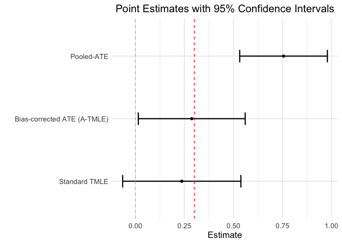

<!-- README.md is generated from README.Rmd. Please edit that file -->

# `atmle`: Adaptive-TMLE for RCT + RWD 

<!-- badges: start -->

[](https://www.gnu.org/licenses/gpl-3.0)
<!-- badges: end -->

> Adaptive Targeted Minimum Loss-Based Estimation. This package uses
> adaptive targeted minimum loss-based estimation to estimate the
> average treatment effect from combined randomized trial and real-world
> data.

**Authors:** [Sky Qiu](https://github.com/tq21), [Lars van der
Laan](https://larsvanderlaan.github.io/) [Mark van der
Laan](https://vanderlaan-lab.org/),

------------------------------------------------------------------------

## Issues

If you encounter any bugs or have any specific feature requests, please
[file an issue](https://github.com/tq21/atmle/issues).

------------------------------------------------------------------------

## Example

``` r
library(atmle)
library(sl3)
library(ggplot2)
seed <- 113

data(sample_data)

sl_lib <- list(Lrnr_glm$new(),
               Lrnr_dbarts$new(),
               Lrnr_xgboost$new())
set.seed(seed)
tmle_res <- nonparametric(data = mydata,
                          S = "S",
                          W = c("W1", "W2", "W3", "W4"),
                          A = "A",
                          Y = "Y",
                          family = "gaussian",
                          Pi_method = sl_lib,
                          g_method = "glm",
                          Q_method = sl_lib,
                          Q_pooling = TRUE,
                          v_folds = 5)
```

``` r
set.seed(seed)
atmle_res <- atmle(data = mydata, 
                   S = "S", 
                   W = c("W1", "W2", "W3", "W4"), 
                   A = "A",
                   Y = "Y",
                   family = "gaussian",
                   theta_method = sl_lib, 
                   Pi_method = sl_lib, 
                   g_method = sl_lib, 
                   theta_tilde_method = sl_lib, 
                   bias_working_model = "HAL",
                   pooled_working_model = "HAL",
                   target_method = "oneshot",
                   enumerate_basis_args = list(max_degree = 3,
                                               smoothness_orders = 1),
                   v_folds = 5)
#> learning θ(W,A)=E(Y|W,A)...Done!
#> learning g(1|W)=P(A=1|W)...Done!
#> learning Π(S=1|W,A)=P(S=1|W,A)...Done!
#> learning τ(W,A)=E(Y|S=1,W,A)-E(Y|S=0,W,A)...Done!
#> [1] -0.002126372
#> learning θ̃(W)=E(Y|W)...Done!
#> learning Τ(W)=E(Y|W,A=1)-E(Y|W,A=0)...Done!
#> 
#> targeting beta_A...Done!
#> 
#> Pooled ATE: 0.75524 (0.53173, 0.97874)
#> Bias: 0.46795 (0.27789, 0.658)
#> Bias-corrected ATE: 0.28729 (0.014865, 0.55972)
```

``` r
df_plot <- data.frame(Estimator = c("Standard TMLE",
                                    "Pooled-ATE", 
                                    "Bias-corrected ATE (A-TMLE)"),
                      Estimate = c(tmle_res$psi_pooled_W, 
                                   atmle_res$psi_tilde_est, 
                                   atmle_res$est),
                      Lower = c(tmle_res$lower_pooled_W, 
                                atmle_res$psi_tilde_lower, 
                                atmle_res$lower),
                      Upper = c(tmle_res$upper_pooled_W, 
                                atmle_res$psi_tilde_upper, 
                                atmle_res$upper))
df_plot$Estimator <- factor(df_plot$Estimator, 
                            levels = c("Standard TMLE",
                                       "Bias-corrected ATE (A-TMLE)", 
                                       "Pooled-ATE"))
ggplot(df_plot, aes(x = Estimator, y = Estimate, fill = Estimator)) +
  geom_point() +
  geom_errorbar(aes(ymin = Lower, ymax = Upper), width = 0.2, size = 0.8) +
  geom_hline(yintercept = 0.3, linetype = "dashed", color = "red") +
  geom_hline(yintercept = 0, linetype = "dashed", color = "gray") +
  theme_minimal(base_size = 13) +
  labs(title = "Point Estimates with 95% Confidence Intervals",
       y = "Estimate",
       x = "") +
  theme(legend.position = "none",
        plot.title = element_text(hjust = 0.5)) +
  coord_flip()
#> Warning: Using `size` aesthetic for lines was deprecated in ggplot2 3.4.0.
#> ℹ Please use `linewidth` instead.
#> This warning is displayed once every 8 hours.
#> Call `lifecycle::last_lifecycle_warnings()` to see where this warning was
#> generated.
```



------------------------------------------------------------------------

## License

© 2025 [Sky Qiu](https://github.com/tq21), [Lars van der
Laan](https://larsvanderlaan.github.io/) [Mark van der
Laan](https://vanderlaan-lab.org/),

The contents of this repository are distributed under the GPL-3 license.
See file `LICENSE` for details.

------------------------------------------------------------------------
